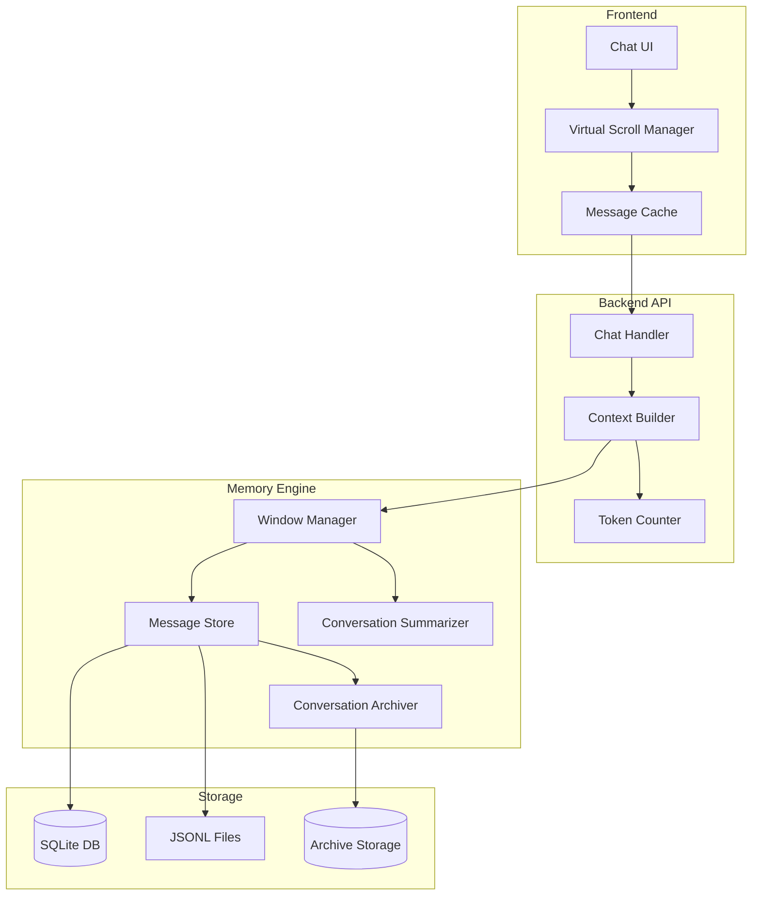

# Design Document: Chat Conversation Management

## Overview

This design implements intelligent conversation history management for Prometheus's chat interface. The solution addresses performance degradation, token cost optimization, and context window limitations through a multi-layered approach:

1. **Token-based windowing** - Dynamically adjusts message inclusion based on token counts
2. **Sliding window with summarization** - Maintains recent context while summarizing older messages
3. **Message importance scoring** - Prioritizes critical messages for retention
4. **Frontend virtualization** - Renders only visible messages for UI performance
5. **Conversation archiving** - Moves inactive conversations to long-term storage

The design maintains backward compatibility with the existing OpenClaw pattern (SQLite + JSONL) while adding new capabilities for token tracking, summarization, and intelligent context management.

## Architecture

### High-Level Architecture



### Component Responsibilities

**Frontend Components:**
- **Chat UI**: Displays messages and handles user interactions
- **Virtual Scroll Manager**: Manages DOM rendering of visible messages only
- **Message Cache**: Caches loaded message pages to reduce API calls

**Backend Components:**
- **Chat Handler**: Orchestrates chat request processing
- **Context Builder**: Assembles LLM context from conversation history
- **Token Counter**: Calculates token counts for messages and context

**Memory Engine Components:**
- **Message Store**: Persists and retrieves messages (existing functionality)
- **Window Manager**: Implements sliding window and token-based selection
- **Conversation Summarizer**: Generates summaries of message batches
- **Conversation Archiver**: Moves old conversations to archive storage

## Components and Interfaces

### 1. Token Counter

Calculates token counts for text using tiktoken (OpenAI's tokenizer library).

```typescript
interface TokenCounter {
  /**
   * Count tokens in a text string
   * @param text - Text to count tokens for
   * @param model - Model name for tokenizer selection (default: 'gpt-4')
   * @returns Token count
   */
  countTokens(text: string, model?: string): number;
  
  /**
   * Count tokens in a message including role overhead
   * @param message - Message to count tokens for
   * @param model - Model name for tokenizer selection
   * @returns Token count including message formatting overhead
   */
  countMessageTokens(message: ConversationMessage, model?: string): number;
  
  /**
   * Count tokens in an array of messages
   * @param messages - Messages to count tokens for
   * @param model - Model name for tokenizer selection
   * @returns Total token count
   */
  countMessagesTokens(messages: ConversationMessage[], model?: string): number;
}

class TiktokenCounter implements TokenCounter {
  private encoders: Map<string, Tiktoken>;
  
  constructor() {
    this.encoders = new Map();
  }
  
  countTokens(text: string, model: string = 'gpt-4'): number {
    const encoder = this.getEncoder(model);
    return encoder.encode(text).length;
  }
  
  countMessageTokens(message: ConversationMessage, model: string = 'gpt-4'): number {
    // OpenAI message format overhead: ~4 tokens per message
    // <|start|>role<|message|>content<|end|>
    const overhead = 4;
    const roleTokens = this.countTokens(message.role, model);
    const contentTokens = this.countTokens(message.content, model);
    return overhead + roleTokens + contentTokens;
  }
  
  countMessagesTokens(messages: ConversationMessage[], model: string = 'gpt-4'): number {
    return messages.reduce((sum, msg) => sum + this.countMessageTokens(msg, model), 0);
  }
  
  private getEncoder(model: string): Tiktoken {
    if (!this.encoders.has(model)) {
      // Map model names to encoding schemes
      const encoding = this.getEncodingForModel(model);
      this.encoders.set(model, encoding);
    }
    return this.encoders.get(model)!;
  }
  
  private getEncodingForModel(model: string): Tiktoken {
    // gpt-4, gpt-3.5-turbo use cl100k_base
    // gpt-3 uses p50k_base
    if (model.includes('gpt-4') || model.includes('gpt-3.5')) {
      return encoding_for_model('gpt-4');
    }
    return encoding_for_model('gpt-3.5-turbo');
  }
}
```

### 2. Message Importance Scorer

Assigns importance scores to messages for prioritization during context reduction.

```typescript
interface ImportanceScorer {
  /**
   * Calculate importance score for a message
   * @param message - Message to score
   * @param conversationContext - Additional context about the conversation
   * @returns Importance score (0-100)
   */
  scoreMessage(message: ConversationMessage, conversationContext: ConversationContext): number;
}

interface ConversationContext {
  totalMessages: number;
  messageIndex: number; // Position in conversation (0 = oldest)
  hasToolCalls: boolean;
  isSystemMessage: boolean;
}

class DefaultImportanceScorer implements ImportanceScorer {
  scoreMessage(message: ConversationMessage, context: ConversationContext): number {
    let score = 0;
    
    // Base score by role
    if (message.role === 'system') {
      score += 90; // System messages are critical
    } else if (message.role === 'assistant') {
      score += 30;
    } else {
      score += 40; // User messages slightly more important
    }
    
    // Recency bonus (exponential decay)
    const recencyRatio = context.messageIndex / context.totalMessages;
    const recencyBonus = 30 * Math.pow(recencyRatio, 2);
    score += recencyBonus;
    
    // Tool call bonus
    if (context.hasToolCalls) {
      score += 25;
    }
    
    // Content length penalty (very long messages less important)
    const contentLength = message.content.length;
    if (contentLength > 5000) {
      score -= 10;
    }
    
    return Math.min(100, Math.max(0, score));
  }
}
```

### 3. Window Manager

Implements sliding window logic and token-based message selection.

```typescript
interface WindowManager {
  /**
   * Select messages for LLM context based on token budget
   * @param conversationId - Conversation ID
   * @param tokenBudget - Maximum tokens allowed
   * @param options - Additional options
   * @returns Selected messages and summary
   */
  selectMessagesForContext(
    conversationId: string,
    tokenBudget: number,
    options?: WindowOptions
  ): Promise<WindowResult>;
}

interface WindowOptions {
  activeWindowSize?: number; // Number of recent messages to always include
  includeSummary?: boolean; // Whether to include conversation summary
  model?: string; // Model name for token counting
}

interface WindowResult {
  messages: ConversationMessage[];
  summary: string | null;
  totalTokens: number;
  messagesIncluded: number;
  messagesExcluded: number;
}

class SlidingWindowManager implements WindowManager {
  constructor(
    private memoryEngine: IMemoryEngine,
    private tokenCounter: TokenCounter,
    private importanceScorer: ImportanceScorer,
    private config: WindowConfig
  ) {}
  
  async selectMessagesForContext(
    conversationId: string,
    tokenBudget: number,
    options?: WindowOptions
  ): Promise<WindowResult> {
    const activeWindowSize = options?.activeWindowSize ?? this.config.defaultActiveWindowSize;
    const includeSummary = options?.includeSummary ?? true;
    const model = options?.model ?? 'gpt-4';
    
    // Get all messages
    const allMessages = await this.memoryEngine.getConversationHistory(conversationId);
    
    if (allMessages.length === 0) {
      return {
        messages: [],
        summary: null,
        totalTokens: 0,
        messagesIncluded: 0,
        messagesExcluded: 0,
      };
    }
    
    // Always include recent messages (active window)
    const recentMessages = allMessages.slice(-activeWindowSize);
    let selectedMessages = [...recentMessages];
    let currentTokens = this.tokenCounter.countMessagesTokens(selectedMessages, model);
    
    // Reserve tokens for summary if needed
    const summaryTokenBudget = includeSummary ? this.config.maxSummaryTokens : 0;
    const availableTokens = tokenBudget - summaryTokenBudget;
    
    // If active window fits, try to add more messages by importance
    if (currentTokens < availableTokens && allMessages.length > activeWindowSize) {
      const olderMessages = allMessages.slice(0, -activeWindowSize);
      const scoredMessages = this.scoreMessages(olderMessages, allMessages.length);
      
      // Sort by importance (descending)
      scoredMessages.sort((a, b) => b.score - a.score);
      
      // Add messages until token budget exhausted
      for (const { message } of scoredMessages) {
        const messageTokens = this.tokenCounter.countMessageTokens(message, model);
        if (currentTokens + messageTokens <= availableTokens) {
          selectedMessages.unshift(message);
          currentTokens += messageTokens;
        }
      }
      
      // Sort selected messages chronologically
      selectedMessages.sort((a, b) => a.timestamp - b.timestamp);
    }
    
    // Generate summary if needed
    let summary: string | null = null;
    if (includeSummary && selectedMessages.length < allMessages.length) {
      const excludedMessages = allMessages.filter(
        msg => !selectedMessages.find(sm => sm.id === msg.id)
      );
      summary = await this.generateSummary(excludedMessages, summaryTokenBudget);
      currentTokens += this.tokenCounter.countTokens(summary, model);
    }
    
    return {
      messages: selectedMessages,
      summary,
      totalTokens: currentTokens,
      messagesIncluded: selectedMessages.length,
      messagesExcluded: allMessages.length - selectedMessages.length,
    };
  }
  
  private scoreMessages(
    messages: ConversationMessage[],
    totalMessages: number
  ): Array<{ message: ConversationMessage; score: number }> {
    return messages.map((message, index) => {
      const metadata = message.metadata ? JSON.parse(message.metadata) : {};
      const context: ConversationContext = {
        totalMessages,
        messageIndex: index,
        hasToolCalls: !!metadata.tool_calls,
        isSystemMessage: message.role === 'system',
      };
      
      return {
        message,
        score: this.importanceScorer.scoreMessage(message, context),
      };
    });
  }
  
  private async generateSummary(
    messages: ConversationMessage[],
    tokenBudget: number
  ): Promise<string> {
    // Delegate to Conversation Summarizer
    // Implementation in next section
    return `Summary of ${messages.length} earlier messages...`;
  }
}

interface WindowConfig {
  defaultActiveWindowSize: number;
  maxSummaryTokens: number;
}
```

### 4. Conversation Summarizer

Generates concise summaries of message batches using an LLM.

```typescript
interface ConversationSummarizer {
  /**
   * Generate a summary of messages
   * @param messages - Messages to summarize
   * @param tokenBudget - Maximum tokens for summary
   * @returns Summary text
   */
  summarize(messages: ConversationMessage[], tokenBudget: number): Promise<string>;
  
  /**
   * Store a summary in the conversation history
   * @param conversationId - Conversation ID
   * @param summary - Summary text
   * @param messageRange - Range of messages summarized
   * @returns Summary message ID
   */
  storeSummary(
    conversationId: string,
    summary: string,
    messageRange: { start: string; end: string }
  ): Promise<string>;
}

class LLMConversationSummarizer implements ConversationSummarizer {
  constructor(
    private memoryEngine: IMemoryEngine,
    private llmProvider: LLMProvider,
    private tokenCounter: TokenCounter
  ) {}
  
  async summarize(messages: ConversationMessage[], tokenBudget: number): Promise<string> {
    if (messages.length === 0) {
      return '';
    }
    
    // Build prompt for summarization
    const conversationText = messages
      .map(msg => `${msg.role}: ${msg.content}`)
      .join('\n\n');
    
    const prompt = `Summarize the following conversation, preserving key information, decisions, user preferences, and important context. Keep the summary under ${tokenBudget} tokens.

Conversation:
${conversationText}

Summary:`;
    
    try {
      const response = await this.llmProvider.complete({
        prompt,
        maxTokens: tokenBudget,
        temperature: 0.3, // Lower temperature for factual summarization
      });
      
      return response.text.trim();
    } catch (error) {
      console.error('Summarization failed:', error);
      // Fallback: create simple summary
      return this.createFallbackSummary(messages, tokenBudget);
    }
  }
  
  async storeSummary(
    conversationId: string,
    summary: string,
    messageRange: { start: string; end: string }
  ): Promise<string> {
    const metadata = {
      type: 'summary',
      messageRange,
      generatedAt: Date.now(),
    };
    
    return await this.memoryEngine.storeMessage(
      conversationId,
      'system',
      `[Conversation Summary]\n${summary}`,
      metadata
    );
  }
  
  private createFallbackSummary(messages: ConversationMessage[], tokenBudget: number): string {
    // Simple fallback: take first and last messages
    const first = messages[0];
    const last = messages[messages.length - 1];
    
    let summary = `Earlier conversation (${messages.length} messages):\n`;
    summary += `Started with: ${first.content.substring(0, 100)}...\n`;
    summary += `Ended with: ${last.content.substring(0, 100)}...`;
    
    // Truncate if over budget
    const tokens = this.tokenCounter.countTokens(summary);
    if (tokens > tokenBudget) {
      const ratio = tokenBudget / tokens;
      const targetLength = Math.floor(summary.length * ratio);
      summary = summary.substring(0, targetLength) + '...';
    }
    
    return summary;
  }
}
```

### 5. Context Builder (Enhanced)

Enhanced version of the existing context builder with token management.

```typescript
interface ContextBuilder {
  /**
   * Build LLM context from conversation history
   * @param conversationId - Conversation ID
   * @param options - Context building options
   * @returns Context string and metadata
   */
  buildContext(conversationId: string, options?: ContextOptions): Promise<ContextResult>;
}

interface ContextOptions {
  tokenBudget?: number;
  activeWindowSize?: number;
  includeSummary?: boolean;
  model?: string;
  systemPrompt?: string;
}

interface ContextResult {
  messages: ConversationMessage[];
  summary: string | null;
  totalTokens: number;
  formattedContext: string;
}

class EnhancedContextBuilder implements ContextBuilder {
  constructor(
    private windowManager: WindowManager,
    private tokenCounter: TokenCounter,
    private config: ContextBuilderConfig
  ) {}
  
  async buildContext(
    conversationId: string,
    options?: ContextOptions
  ): Promise<ContextResult> {
    const tokenBudget = options?.tokenBudget ?? this.config.defaultTokenBudget;
    const systemPrompt = options?.systemPrompt ?? this.config.defaultSystemPrompt;
    
    // Reserve tokens for system prompt
    const systemPromptTokens = this.tokenCounter.countTokens(systemPrompt);
    const availableTokens = tokenBudget - systemPromptTokens;
    
    // Get messages using window manager
    const windowResult = await this.windowManager.selectMessagesForContext(
      conversationId,
      availableTokens,
      {
        activeWindowSize: options?.activeWindowSize,
        includeSummary: options?.includeSummary,
        model: options?.model,
      }
    );
    
    // Format context
    let formattedContext = systemPrompt + '\n\n';
    
    if (windowResult.summary) {
      formattedContext += windowResult.summary + '\n\n';
    }
    
    formattedContext += 'Conversation:\n';
    formattedContext += windowResult.messages
      .map(msg => `${msg.role}: ${msg.content}`)
      .join('\n\n');
    
    return {
      messages: windowResult.messages,
      summary: windowResult.summary,
      totalTokens: systemPromptTokens + windowResult.totalTokens,
      formattedContext,
    };
  }
}

interface ContextBuilderConfig {
  defaultTokenBudget: number;
  defaultSystemPrompt: string;
}
```

### 6. Frontend Virtual Scroll Manager

Manages efficient rendering of large message lists.

```typescript
interface VirtualScrollManager {
  /**
   * Initialize virtual scrolling for a message list
   * @param container - Container element
   * @param options - Virtual scroll options
   */
  initialize(container: HTMLElement, options: VirtualScrollOptions): void;
  
  /**
   * Load more messages when scrolling to top
   * @returns Promise that resolves when messages are loaded
   */
  loadPreviousPage(): Promise<void>;
  
  /**
   * Scroll to a specific message
   * @param messageId - Message ID to scroll to
   */
  scrollToMessage(messageId: string): void;
  
  /**
   * Clean up resources
   */
  destroy(): void;
}

interface VirtualScrollOptions {
  pageSize: number;
  itemHeight: number; // Estimated height per message
  overscan: number; // Number of items to render outside viewport
  onLoadMore: () => Promise<ConversationMessage[]>;
}

class ReactVirtualScrollManager implements VirtualScrollManager {
  private container: HTMLElement | null = null;
  private options: VirtualScrollOptions | null = null;
  private visibleRange: { start: number; end: number } = { start: 0, end: 0 };
  private scrollListener: (() => void) | null = null;
  
  initialize(container: HTMLElement, options: VirtualScrollOptions): void {
    this.container = container;
    this.options = options;
    
    // Set up scroll listener
    this.scrollListener = this.handleScroll.bind(this);
    container.addEventListener('scroll', this.scrollListener);
    
    // Initial render
    this.updateVisibleRange();
  }
  
  private handleScroll(): void {
    if (!this.container || !this.options) return;
    
    // Check if scrolled to top
    if (this.container.scrollTop < 100) {
      this.loadPreviousPage();
    }
    
    // Update visible range
    this.updateVisibleRange();
  }
  
  private updateVisibleRange(): void {
    if (!this.container || !this.options) return;
    
    const scrollTop = this.container.scrollTop;
    const viewportHeight = this.container.clientHeight;
    
    const start = Math.floor(scrollTop / this.options.itemHeight);
    const end = Math.ceil((scrollTop + viewportHeight) / this.options.itemHeight);
    
    this.visibleRange = {
      start: Math.max(0, start - this.options.overscan),
      end: end + this.options.overscan,
    };
  }
  
  async loadPreviousPage(): Promise<void> {
    if (!this.options) return;
    
    try {
      const messages = await this.options.onLoadMore();
      // Messages loaded, trigger re-render
      // Implementation depends on React state management
    } catch (error) {
      console.error('Failed to load previous page:', error);
    }
  }
  
  scrollToMessage(messageId: string): void {
    // Implementation depends on message list structure
    const element = document.getElementById(`message-${messageId}`);
    if (element) {
      element.scrollIntoView({ behavior: 'smooth', block: 'center' });
    }
  }
  
  destroy(): void {
    if (this.container && this.scrollListener) {
      this.container.removeEventListener('scroll', this.scrollListener);
    }
    this.container = null;
    this.options = null;
    this.scrollListener = null;
  }
}
```

### 7. Conversation Archiver

Moves inactive conversations to archive storage.

```typescript
interface ConversationArchiver {
  /**
   * Archive conversations older than the specified age
   * @param maxAgeMs - Maximum age in milliseconds
   * @returns Number of conversations archived
   */
  archiveOldConversations(maxAgeMs: number): Promise<number>;
  
  /**
   * Restore an archived conversation
   * @param conversationId - Conversation ID to restore
   * @returns True if restored successfully
   */
  restoreConversation(conversationId: string): Promise<boolean>;
  
  /**
   * List archived conversations
   * @param options - List options
   * @returns Archived conversation metadata
   */
  listArchivedConversations(options?: ListOptions): Promise<ArchivedConversation[]>;
}

interface ArchivedConversation {
  id: string;
  title: string;
  messageCount: number;
  archivedAt: number;
  lastMessageAt: number;
}

interface ListOptions {
  limit?: number;
  offset?: number;
}

class FileSystemConversationArchiver implements ConversationArchiver {
  constructor(
    private memoryEngine: IMemoryEngine,
    private archivePath: string
  ) {}
  
  async archiveOldConversations(maxAgeMs: number): Promise<number> {
    const cutoffTime = Date.now() - maxAgeMs;
    const allConversations = await this.memoryEngine.getAllConversations();
    
    let archivedCount = 0;
    
    for (const conversation of allConversations) {
      if (conversation.updated_at < cutoffTime) {
        try {
          await this.archiveConversation(conversation.id);
          archivedCount++;
        } catch (error) {
          console.error(`Failed to archive conversation ${conversation.id}:`, error);
        }
      }
    }
    
    return archivedCount;
  }
  
  private async archiveConversation(conversationId: string): Promise<void> {
    // Get all messages
    const messages = await this.memoryEngine.getConversationHistory(conversationId);
    
    // Create archive file
    const archiveFile = path.join(this.archivePath, `${conversationId}.json`);
    const archiveData = {
      id: conversationId,
      messages,
      archivedAt: Date.now(),
    };
    
    await fs.promises.writeFile(archiveFile, JSON.stringify(archiveData, null, 2));
    
    // Delete from active storage
    await this.memoryEngine.deleteConversation(conversationId);
  }
  
  async restoreConversation(conversationId: string): Promise<boolean> {
    const archiveFile = path.join(this.archivePath, `${conversationId}.json`);
    
    try {
      const data = await fs.promises.readFile(archiveFile, 'utf-8');
      const archiveData = JSON.parse(data);
      
      // Recreate conversation
      await this.memoryEngine.createConversation(conversationId);
      
      // Restore messages
      for (const message of archiveData.messages) {
        await this.memoryEngine.storeMessage(
          conversationId,
          message.role,
          message.content,
          message.metadata ? JSON.parse(message.metadata) : undefined
        );
      }
      
      // Delete archive file
      await fs.promises.unlink(archiveFile);
      
      return true;
    } catch (error) {
      console.error(`Failed to restore conversation ${conversationId}:`, error);
      return false;
    }
  }
  
  async listArchivedConversations(options?: ListOptions): Promise<ArchivedConversation[]> {
    const files = await fs.promises.readdir(this.archivePath);
    const jsonFiles = files.filter(f => f.endsWith('.json'));
    
    const conversations: ArchivedConversation[] = [];
    
    for (const file of jsonFiles) {
      try {
        const data = await fs.promises.readFile(
          path.join(this.archivePath, file),
          'utf-8'
        );
        const archiveData = JSON.parse(data);
        
        conversations.push({
          id: archiveData.id,
          title: archiveData.messages[0]?.content.substring(0, 50) || 'Untitled',
          messageCount: archiveData.messages.length,
          archivedAt: archiveData.archivedAt,
          lastMessageAt: archiveData.messages[archiveData.messages.length - 1]?.timestamp || 0,
        });
      } catch (error) {
        console.error(`Failed to read archive file ${file}:`, error);
      }
    }
    
    // Sort by archived date (most recent first)
    conversations.sort((a, b) => b.archivedAt - a.archivedAt);
    
    // Apply pagination
    const limit = options?.limit ?? 50;
    const offset = options?.offset ?? 0;
    return conversations.slice(offset, offset + limit);
  }
}
```

## Data Models

### Enhanced ConversationMessage

Extends the existing ConversationMessage with token tracking.

```typescript
// Existing interface (no changes to database schema)
export interface ConversationMessage {
  id: string;
  conversation_id: string;
  role: 'user' | 'assistant' | 'system';
  content: string;
  timestamp: number;
  metadata: string | null; // JSON object
}

// Enhanced metadata structure
export interface EnhancedConversationMessageMetadata extends ConversationMessageMetadata {
  tokens?: number; // Token count for this message
  importance_score?: number; // Importance score (0-100)
  tool_calls?: ToolCall[]; // Tool calls in this message
  summary_of?: { start: string; end: string }; // If this is a summary message
}

export interface ToolCall {
  name: string;
  arguments: Record<string, unknown>;
  result?: unknown;
}
```

### Configuration Schema

```typescript
export interface ConversationManagementConfig {
  // Token limits
  maxContextTokens: number; // Default: 100000
  maxSummaryTokens: number; // Default: 1000
  
  // Window settings
  activeWindowSize: number; // Default: 20 messages
  summarizationThreshold: number; // Default: 50 messages
  
  // Frontend settings
  frontendPageSize: number; // Default: 50 messages
  virtualScrollOverscan: number; // Default: 5 messages
  
  // Archiving settings
  archiveAgeDays: number; // Default: 30 days
  archivePath: string; // Default: './data/archives'
  
  // Model settings
  defaultModel: string; // Default: 'gpt-4'
  summarizationModel: string; // Default: 'gpt-3.5-turbo'
}

// Load from environment variables
export function loadConversationManagementConfig(): ConversationManagementConfig {
  return {
    maxContextTokens: parseInt(process.env.MAX_CONTEXT_TOKENS || '100000'),
    maxSummaryTokens: parseInt(process.env.MAX_SUMMARY_TOKENS || '1000'),
    activeWindowSize: parseInt(process.env.ACTIVE_WINDOW_SIZE || '20'),
    summarizationThreshold: parseInt(process.env.SUMMARIZATION_THRESHOLD || '50'),
    frontendPageSize: parseInt(process.env.FRONTEND_PAGE_SIZE || '50'),
    virtualScrollOverscan: parseInt(process.env.VIRTUAL_SCROLL_OVERSCAN || '5'),
    archiveAgeDays: parseInt(process.env.ARCHIVE_AGE_DAYS || '30'),
    archivePath: process.env.ARCHIVE_PATH || './data/archives',
    defaultModel: process.env.DEFAULT_MODEL || 'gpt-4',
    summarizationModel: process.env.SUMMARIZATION_MODEL || 'gpt-3.5-turbo',
  };
}
```

### Database Schema Changes

No changes to existing tables. Token counts and importance scores stored in the `metadata` JSON field.

```sql
-- Existing schema (no changes)
CREATE TABLE IF NOT EXISTS conversation_messages (
  id TEXT PRIMARY KEY,
  conversation_id TEXT NOT NULL,
  role TEXT NOT NULL CHECK(role IN ('user', 'assistant', 'system')),
  content TEXT NOT NULL,
  timestamp INTEGER NOT NULL,
  metadata TEXT, -- JSON object with tokens, importance_score, etc.
  FOREIGN KEY (conversation_id) REFERENCES conversations(id) ON DELETE CASCADE
);

-- Add index for efficient timestamp queries (for archiving)
CREATE INDEX IF NOT EXISTS idx_conversations_updated_at 
ON conversations(updated_at);
```


## Correctness Properties

A property is a characteristic or behavior that should hold true across all valid executions of a system—essentially, a formal statement about what the system should do. Properties serve as the bridge between human-readable specifications and machine-verifiable correctness guarantees.

### Property 1: Token Count Storage

*For any* message stored in the system, retrieving that message should return metadata containing a valid token count field.

**Validates: Requirements 1.1**

### Property 2: Context Token Calculation Accuracy

*For any* conversation history, the total token count returned by the context builder should match the sum of individual message token counts.

**Validates: Requirements 1.2**

### Property 3: Token Budget Enforcement

*For any* conversation and token budget, the context returned by the window manager should never exceed the specified token budget.

**Validates: Requirements 1.3**

### Property 4: Recent Message Prioritization

*For any* conversation where context reduction is needed, the N most recent messages should always be included in the selected context.

**Validates: Requirements 1.4, 2.1, 2.2**

### Property 5: Active Window Consistency

*For any* conversation with more than N messages, the active window should always contain exactly the N most recent messages in chronological order.

**Validates: Requirements 2.1, 2.5**

### Property 6: Summary Inclusion for Long Conversations

*For any* conversation where messages exist outside the active window, the context should include a summary when summarization is enabled.

**Validates: Requirements 2.3**

### Property 7: Window Size Configuration

*For any* configured active window size, the window manager should respect that size when selecting messages.

**Validates: Requirements 2.4**

### Property 8: Summarization Threshold Trigger

*For any* conversation exceeding the summarization threshold, requesting context should trigger summary generation for excluded messages.

**Validates: Requirements 1.5, 3.1**

### Property 9: Summary Storage Format

*For any* generated summary, it should be stored as a system message with metadata indicating it's a summary and the message range it covers.

**Validates: Requirements 3.3**

### Property 10: Summary Placement in Context

*For any* conversation with both a summary and active window messages, the summary should appear before the active window messages in the formatted context.

**Validates: Requirements 3.4**

### Property 11: Message Importance Scoring Rules

*For any* message, its importance score should follow these rules: system messages score highest, tool call messages score high, and recent messages score higher than older messages.

**Validates: Requirements 4.1, 4.2, 4.3, 4.4**

### Property 12: Importance-Based Retention

*For any* set of messages requiring reduction to fit token limits, messages with higher importance scores should be retained preferentially over lower-scored messages (excluding the active window which is always retained).

**Validates: Requirements 4.5**

### Property 13: Virtual Scroll DOM Efficiency

*For any* message list with virtual scrolling enabled, the number of DOM elements should be proportional to the viewport size, not the total message count.

**Validates: Requirements 5.1, 5.3**

### Property 14: Paginated Loading Size

*For any* configured page size, loading a page of messages should return exactly that number of messages (or fewer if at conversation start).

**Validates: Requirements 6.1**

### Property 15: Message List Deduplication

*For any* sequence of page loads, the resulting message list should contain no duplicate messages.

**Validates: Requirements 6.4**

### Property 16: Conversation Token Total Maintenance

*For any* conversation, the running token total should equal the sum of all message token counts in that conversation.

**Validates: Requirements 7.2**

### Property 17: Archive Identification

*For any* conversation with an updated_at timestamp older than the configured archive age, it should be identified as eligible for archiving.

**Validates: Requirements 8.1**

### Property 18: Archive Round-Trip Preservation

*For any* conversation that is archived and then restored, the restored conversation should contain the same messages in the same order as before archiving.

**Validates: Requirements 8.2, 8.3, 8.4**

### Property 19: User Preference Preservation in Summaries

*For any* set of messages containing user preferences or instructions, the generated summary should include those preferences.

**Validates: Requirements 11.2**

### Property 20: Summary Chronological Ordering

*For any* set of messages with timestamps, the generated summary should maintain chronological ordering of events.

**Validates: Requirements 11.3**

### Property 21: Summary Token Budget Compliance

*For any* generated summary with a specified token budget, the summary should not exceed that token budget.

**Validates: Requirements 11.4**

### Property 22: Configuration Loading

*For any* valid configuration value set in environment variables, the system should load and use that configuration value.

**Validates: Requirements 9.1, 9.2, 9.3, 9.4, 9.5**

## Error Handling

### Error Scenarios and Responses

1. **Summarization Failure**
   - Scenario: LLM API fails during summary generation
   - Response: Log error, continue with active window only, return context without summary
   - User Impact: Minimal - conversation continues with reduced context
   - Recovery: Retry summarization on next request

2. **Token Counting Failure**
   - Scenario: Tiktoken library fails or model encoding unavailable
   - Response: Fall back to character-based estimation (1 token ≈ 4 characters)
   - User Impact: Minimal - slightly less accurate token budgeting
   - Recovery: Log warning, continue with estimation

3. **Database Query Timeout**
   - Scenario: Message retrieval takes too long
   - Response: Return partial results with warning, use cached data if available
   - User Impact: Moderate - may see incomplete history
   - Recovery: Retry with smaller page size

4. **Archive Restoration Failure**
   - Scenario: Archive file corrupted or missing
   - Response: Log error, notify user, keep conversation in archive list
   - User Impact: High - cannot access archived conversation
   - Recovery: Manual intervention required

5. **Virtual Scroll Failure**
   - Scenario: Virtual scroll library throws error
   - Response: Fall back to traditional rendering, log error
   - User Impact: Moderate - UI may be slower with many messages
   - Recovery: Automatic fallback

6. **Context Exceeds Maximum Tokens**
   - Scenario: Even active window exceeds token budget
   - Response: Truncate oldest messages in active window, log warning
   - User Impact: Moderate - some recent context lost
   - Recovery: Suggest user start new conversation

### Error Logging Strategy

All errors should be logged with:
- Timestamp
- Error type and message
- Conversation ID
- User ID (if available)
- Stack trace (for unexpected errors)
- Context information (message count, token count, etc.)

### Graceful Degradation Hierarchy

1. **Full Functionality**: Token-based windowing + summarization + virtual scroll
2. **Degraded Level 1**: Token-based windowing + virtual scroll (no summarization)
3. **Degraded Level 2**: Message count windowing + virtual scroll (no token counting)
4. **Degraded Level 3**: Message count windowing + traditional rendering (no virtual scroll)
5. **Minimal Functionality**: Fixed message limit + traditional rendering

## Testing Strategy

### Dual Testing Approach

This feature requires both unit tests and property-based tests for comprehensive coverage:

- **Unit tests**: Verify specific examples, edge cases, and error conditions
- **Property tests**: Verify universal properties across all inputs

Both approaches are complementary and necessary. Unit tests catch concrete bugs in specific scenarios, while property tests verify general correctness across a wide range of inputs.

### Property-Based Testing

We will use **fast-check** (for TypeScript/JavaScript) as our property-based testing library. Each property test will:

- Run a minimum of 100 iterations with randomized inputs
- Reference its corresponding design document property
- Use the tag format: **Feature: chat-conversation-management, Property {number}: {property_text}**

### Test Categories

**1. Token Management Tests**

Unit tests:
- Token counting for various message types (user, assistant, system)
- Token counting with special characters and emojis
- Token counting edge cases (empty messages, very long messages)
- Fallback to character estimation when tiktoken fails

Property tests:
- Property 1: Token count storage
- Property 2: Context token calculation accuracy
- Property 3: Token budget enforcement
- Property 16: Conversation token total maintenance
- Property 21: Summary token budget compliance

**2. Window Management Tests**

Unit tests:
- Active window with exactly N messages
- Active window with fewer than N messages
- Window sliding when new message added
- Window behavior with different configurations

Property tests:
- Property 4: Recent message prioritization
- Property 5: Active window consistency
- Property 7: Window size configuration

**3. Summarization Tests**

Unit tests:
- Summary generation for small message batch
- Summary generation for large message batch
- Summary with tool calls and system messages
- Summary failure handling

Property tests:
- Property 6: Summary inclusion for long conversations
- Property 8: Summarization threshold trigger
- Property 9: Summary storage format
- Property 10: Summary placement in context
- Property 19: User preference preservation in summaries
- Property 20: Summary chronological ordering

**4. Importance Scoring Tests**

Unit tests:
- System message scoring
- Tool call message scoring
- User message scoring
- Recency bonus calculation

Property tests:
- Property 11: Message importance scoring rules
- Property 12: Importance-based retention

**5. Frontend Virtual Scroll Tests**

Unit tests:
- Initial render with empty list
- Initial render with messages
- Scroll to top triggers load
- Scroll position preservation

Property tests:
- Property 13: Virtual scroll DOM efficiency
- Property 14: Paginated loading size
- Property 15: Message list deduplication

**6. Archiving Tests**

Unit tests:
- Archive single conversation
- Archive multiple conversations
- Restore archived conversation
- List archived conversations

Property tests:
- Property 17: Archive identification
- Property 18: Archive round-trip preservation

**7. Configuration Tests**

Unit tests:
- Load configuration from environment variables
- Load configuration from config file
- Default values when config missing
- Invalid configuration handling

Property tests:
- Property 22: Configuration loading

**8. Integration Tests**

Unit tests:
- End-to-end conversation flow with windowing
- End-to-end conversation flow with summarization
- End-to-end conversation flow with archiving
- Error recovery scenarios

### Test Data Generation

For property-based tests, we will generate:

- **Random messages**: Various lengths, roles, and content types
- **Random conversations**: Different lengths (1-1000 messages)
- **Random token budgets**: From minimal (100 tokens) to large (100k tokens)
- **Random configurations**: Different window sizes, thresholds, and limits
- **Random timestamps**: For testing archiving and recency scoring

### Performance Testing

While not part of property-based testing, we should benchmark:

- Message retrieval time vs. conversation size
- Context building time vs. message count
- Summarization time vs. message batch size
- Virtual scroll rendering time vs. total messages
- Archive operation time vs. conversation size

Target performance metrics (from Requirements 12.1, 12.2):
- Database retrieval: < 100ms for conversations under 1000 messages
- Frontend initial render: < 200ms

### Test Environment Setup

```typescript
// Example test setup
import fc from 'fast-check';
import { describe, it, expect, beforeEach } from 'vitest';
import { TiktokenCounter } from './token-counter';
import { SlidingWindowManager } from './window-manager';
import { createTestMemoryEngine } from './test-utils';

describe('Token Management', () => {
  let tokenCounter: TokenCounter;
  let memoryEngine: IMemoryEngine;
  
  beforeEach(() => {
    tokenCounter = new TiktokenCounter();
    memoryEngine = createTestMemoryEngine();
  });
  
  it('Property 1: Token count storage', async () => {
    // Feature: chat-conversation-management, Property 1: Token count storage
    await fc.assert(
      fc.asyncProperty(
        fc.string({ minLength: 1, maxLength: 1000 }),
        fc.constantFrom('user', 'assistant', 'system'),
        async (content, role) => {
          const convId = await memoryEngine.createConversation();
          const msgId = await memoryEngine.storeMessage(convId, role, content);
          
          const messages = await memoryEngine.getConversationHistory(convId);
          const message = messages.find(m => m.id === msgId);
          
          expect(message).toBeDefined();
          const metadata = JSON.parse(message!.metadata || '{}');
          expect(metadata.tokens).toBeGreaterThan(0);
        }
      ),
      { numRuns: 100 }
    );
  });
});
```

### Continuous Testing

- Run unit tests on every commit
- Run property tests on every pull request
- Run performance benchmarks weekly
- Run integration tests before releases

### Test Coverage Goals

- Line coverage: > 80%
- Branch coverage: > 75%
- Property test coverage: All 22 properties implemented
- Integration test coverage: All major user flows
