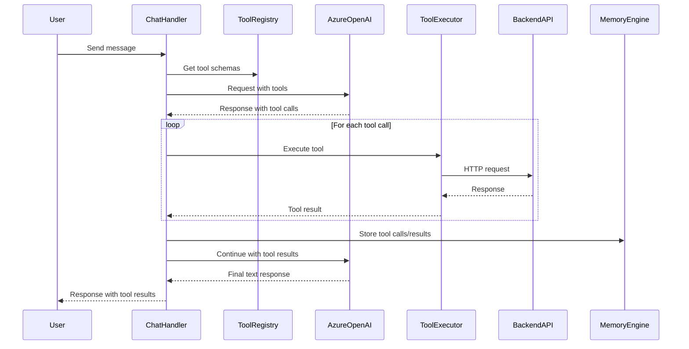

# Design Document: Prometheus Function Calling

## Overview

This design document specifies the implementation of function calling (tools) capability for the Prometheus chat system. The feature enables Prometheus to invoke backend API endpoints, access files, manage repositories, and perform code analysis through natural conversation by leveraging Azure OpenAI's function calling API.

### Goals

1. Enable Prometheus to call backend API endpoints directly during conversations
2. Support multi-step operations where tool results inform subsequent actions
3. Maintain conversation context with tool calls and results
4. Provide robust error handling and fallback mechanisms
5. Ensure security through validation and sanitization
6. Monitor tool usage and performance

### Non-Goals

1. Creating new backend API endpoints (all endpoints already exist)
2. Implementing function calling for non-Azure OpenAI providers in this phase
3. Building a visual tool builder UI
4. Supporting custom user-defined tools

## Architecture

### High-Level Architecture

```
┌─────────────────────────────────────────────────────────────┐
│                        Chat Handler                          │
│                     (src/api/chat.ts)                        │
└───────────────┬─────────────────────────────────────────────┘
                │
                ├─► Tool Registry (tool schemas)
                │
                ├─► Azure OpenAI Provider (with tools)
                │   └─► Function calling API
                │
                ├─► Tool Execution Engine
                │   ├─► API Tool Executor (HTTP requests)
                │   ├─► Validation & Sanitization
                │   └─► Error Handling
                │
                └─► Memory Engine (store tool calls/results)
```

### Component Interaction Flow



## Components and Interfaces

### 1. Tool Registry

**Location:** `src/tools/tool-registry.ts`

**Purpose:** Centralized registry of all available tools with their schemas.

**Interface:**

```typescript
interface ToolParameter {
  type: 'string' | 'number' | 'boolean' | 'object' | 'array';
  description: string;
  enum?: string[];
  required?: boolean;
  properties?: Record<string, ToolParameter>; // For nested objects
  items?: ToolParameter; // For arrays
}

interface ToolSchema {
  name: string;
  description: string;
  parameters: {
    type: 'object';
    properties: Record<string, ToolParameter>;
    required: string[];
  };
}

interface ToolDefinition {
  schema: ToolSchema;
  executor: ToolExecutor;
  category: 'analysis' | 'repository' | 'evolution' | 'workspace' | 'system';
}

class ToolRegistry {
  private tools: Map<string, ToolDefinition>;
  
  constructor();
  
  // Register a new tool
  registerTool(definition: ToolDefinition): void;
  
  // Get tool definition by name
  getTool(name: string): ToolDefinition | undefined;
  
  // Get all tool schemas for LLM
  getAllSchemas(): ToolSchema[];
  
  // Get tools by category
  getToolsByCategory(category: string): ToolDefinition[];
  
  // Check if tool exists
  hasTool(name: string): boolean;
}
```

**Tool Schema Examples:**

```typescript
// Code Quality Analysis Tool
{
  name: "analyze_code_quality",
  description: "Analyze code quality and detect issues in a file. Returns quality score, complexity metrics, and list of issues with suggestions.",
  parameters: {
    type: "object",
    properties: {
      filePath: {
        type: "string",
        description: "Path to the file to analyze (e.g., 'src/api/chat.ts')"
      },
      sourceCode: {
        type: "string",
        description: "Source code content to analyze"
      }
    },
    required: ["filePath", "sourceCode"]
  }
}

// Technical Debt Detection Tool
{
  name: "detect_technical_debt",
  description: "Detect technical debt in a codebase. Returns summary of debt items with estimated effort and priorities.",
  parameters: {
    type: "object",
    properties: {
      codebasePath: {
        type: "string",
        description: "Path to the codebase directory (e.g., './src')"
      },
      options: {
        type: "object",
        description: "Analysis options",
        properties: {
          includeOutdatedDeps: {
            type: "boolean",
            description: "Include outdated dependencies"
          },
          includeTodoComments: {
            type: "boolean",
            description: "Include TODO comments"
          },
          includeMissingTests: {
            type: "boolean",
            description: "Include missing test coverage"
          },
          minPriority: {
            type: "number",
            description: "Minimum priority level (1-5)"
          }
        }
      }
    },
    required: ["codebasePath"]
  }
}

// Repository List Tool
{
  name: "list_repositories",
  description: "List all repositories managed by Prometheus. Returns array of repositories with their status and metadata.",
  parameters: {
    type: "object",
    properties: {},
    required: []
  }
}

// File Read Tool
{
  name: "read_workspace_file",
  description: "Read a file from a repository workspace. Returns file content and metadata.",
  parameters: {
    type: "object",
    properties: {
      repoId: {
        type: "string",
        description: "Repository identifier (e.g., 'prometheus')"
      },
      filePath: {
        type: "string",
        description: "Path to file within repository (e.g., 'src/api/chat.ts')"
      }
    },
    required: ["repoId", "filePath"]
  }
}

// System Stats Tool
{
  name: "get_system_stats",
  description: "Get Prometheus system statistics including memory, runtime, and queue metrics.",
  parameters: {
    type: "object",
    properties: {
      category: {
        type: "string",
        description: "Stats category to retrieve",
        enum: ["memory", "runtime", "queue", "all"]
      }
    },
    required: []
  }
}

// Evolution Analysis Tool
{
  name: "run_self_analysis",
  description: "Run self-analysis on Prometheus codebase to identify improvement opportunities. Returns quality metrics, issues, and improvement suggestions.",
  parameters: {
    type: "object",
    properties: {
      scope: {
        type: "string",
        description: "Analysis scope",
        enum: ["full", "quality", "performance", "security"]
      }
    },
    required: []
  }
}
```

### 2. Tool Execution Engine

**Location:** `src/tools/tool-executor.ts`

**Purpose:** Execute tool calls safely with validation, error handling, and monitoring.

**Interface:**

```typescript
interface ToolExecutionContext {
  conversationId: string;
  userId?: string;
  timestamp: number;
}

interface ToolExecutionResult {
  success: boolean;
  result?: any;
  error?: string;
  executionTime: number;
  metadata?: Record<string, any>;
}

type ToolExecutor = (
  args: Record<string, any>,
  context: ToolExecutionContext
) => Promise<ToolExecutionResult>;

class ToolExecutionEngine {
  private registry: ToolRegistry;
  private metrics: ToolMetrics;
  private circuitBreaker: CircuitBreaker;
  
  constructor(registry: ToolRegistry);
  
  // Execute a single tool call
  async executeTool(
    toolName: string,
    args: Record<string, any>,
    context: ToolExecutionContext
  ): Promise<ToolExecutionResult>;
  
  // Execute multiple tool calls in sequence
  async executeToolSequence(
    toolCalls: Array<{ name: string; args: Record<string, any> }>,
    context: ToolExecutionContext
  ): Promise<ToolExecutionResult[]>;
  
  // Validate tool arguments against schema
  validateArguments(
    toolName: string,
    args: Record<string, any>
  ): { valid: boolean; errors?: string[] };
  
  // Sanitize tool results
  sanitizeResult(result: any): any;
  
  // Get execution metrics
  getMetrics(): ToolMetrics;
}
```

**Tool Executors:**

```typescript
// API Tool Executor (for backend API calls)
class APIToolExecutor {
  private baseUrl: string;
  private timeout: number;
  
  constructor(baseUrl: string, timeout?: number);
  
  async execute(
    endpoint: string,
    method: 'GET' | 'POST' | 'PUT' | 'DELETE',
    body?: any,
    headers?: Record<string, string>
  ): Promise<ToolExecutionResult>;
}

// Example: Code Quality Analysis Executor
async function executeCodeQualityAnalysis(
  args: { filePath: string; sourceCode: string },
  context: ToolExecutionContext
): Promise<ToolExecutionResult> {
  const apiExecutor = new APIToolExecutor('http://localhost:4242');
  
  return await apiExecutor.execute(
    '/api/analyze/quality',
    'POST',
    {
      filePath: args.filePath,
      sourceCode: args.sourceCode
    }
  );
}
```

### 3. Azure OpenAI Provider Enhancement

**Location:** `src/runtime/azure-openai-provider.ts` (modifications)

**Purpose:** Integrate function calling into Azure OpenAI API requests.

**Interface Changes:**

```typescript
// Add to AzureOpenAIRequest interface
interface AzureOpenAIRequest {
  messages: AzureOpenAIMessage[];
  max_tokens?: number;
  temperature?: number;
  stream?: boolean;
  reasoning_effort?: 'low' | 'medium' | 'high';
  tools?: ToolSchema[];  // NEW: Tool schemas
  tool_choice?: 'auto' | 'none' | { type: 'function'; function: { name: string } };  // NEW
}

// Add to AzureOpenAIResponse interface
interface AzureOpenAIResponse {
  id: string;
  object: 'chat.completion';
  created: number;
  model: string;
  choices: Array<{
    index: number;
    message: {
      role: 'assistant';
      content: string | null;  // Can be null when tool calls present
      reasoning_content?: string;
      tool_calls?: Array<{  // NEW: Tool calls from LLM
        id: string;
        type: 'function';
        function: {
          name: string;
          arguments: string;  // JSON string
        };
      }>;
    };
    finish_reason: string;
  }>;
  usage: {
    prompt_tokens: number;
    completion_tokens: number;
    total_tokens: number;
  };
}

// New message type for tool results
interface ToolMessage extends AzureOpenAIMessage {
  role: 'tool';
  tool_call_id: string;
  content: string;  // JSON string of tool result
}

// Enhanced callAzureOpenAI function
export async function callAzureOpenAIWithTools(
  request: RuntimeRequest,
  model: ModelRef,
  config: AzureOpenAIConfig,
  tools?: ToolSchema[],
  previousMessages?: AzureOpenAIMessage[],
  signal?: AbortSignal
): Promise<RuntimeResponseWithTools>;

interface RuntimeResponseWithTools extends RuntimeResponse {
  toolCalls?: Array<{
    id: string;
    name: string;
    arguments: Record<string, any>;
  }>;
  requiresToolExecution: boolean;
}
```

### 4. Chat Handler Enhancement

**Location:** `src/api/chat.ts` (modifications)

**Purpose:** Orchestrate tool calling flow in chat conversations.

**Enhanced Flow:**

```typescript
async function handleChatRequestWithTools(
  req: Request,
  res: Response
): Promise<void> {
  // 1. Get user message and conversation history
  const { conversationId, message } = req.body;
  const history = await memoryEngine.getConversationHistory(conversationId);
  
  // 2. Get tool schemas from registry
  const toolRegistry = getToolRegistry();
  const toolSchemas = toolRegistry.getAllSchemas();
  
  // 3. Build messages with history
  const messages = buildMessagesFromHistory(history);
  messages.push({ role: 'user', content: message });
  
  // 4. Call LLM with tools
  let response = await callAzureOpenAIWithTools(
    request,
    model,
    config,
    toolSchemas,
    messages
  );
  
  // 5. Tool execution loop
  const maxIterations = 10;
  let iteration = 0;
  
  while (response.requiresToolExecution && iteration < maxIterations) {
    iteration++;
    
    // Store assistant message with tool calls
    await memoryEngine.storeMessage(
      conversationId,
      'assistant',
      null,  // No text content
      { toolCalls: response.toolCalls }
    );
    
    // Execute tools
    const toolResults = await executeTools(
      response.toolCalls,
      { conversationId, timestamp: Date.now() }
    );
    
    // Store tool results
    for (const result of toolResults) {
      await memoryEngine.storeToolResult(
        conversationId,
        result.toolCallId,
        result.result
      );
    }
    
    // Add tool results to messages
    const toolMessages = toolResults.map(r => ({
      role: 'tool',
      tool_call_id: r.toolCallId,
      content: JSON.stringify(r.result)
    }));
    
    messages.push(...toolMessages);
    
    // Continue conversation with tool results
    response = await callAzureOpenAIWithTools(
      request,
      model,
      config,
      toolSchemas,
      messages
    );
  }
  
  // 6. Store final response
  await memoryEngine.storeMessage(
    conversationId,
    'assistant',
    response.content,
    { model: response.model, usage: response.usage }
  );
  
  // 7. Return response
  res.json({
    conversationId,
    content: response.content,
    toolCallsExecuted: iteration,
    // ... other fields
  });
}
```

### 5. Memory Engine Enhancement

**Location:** `src/memory/memory-engine.ts` (modifications)

**Purpose:** Store and retrieve tool calls and results in conversation history.

**Schema Changes:**

```sql
-- Add tool_calls column to messages table
ALTER TABLE messages ADD COLUMN tool_calls TEXT;  -- JSON array of tool calls
ALTER TABLE messages ADD COLUMN tool_results TEXT;  -- JSON array of tool results

-- Or create separate table for tool calls
CREATE TABLE IF NOT EXISTS tool_calls (
  id TEXT PRIMARY KEY,
  message_id TEXT NOT NULL,
  conversation_id TEXT NOT NULL,
  tool_name TEXT NOT NULL,
  arguments TEXT NOT NULL,  -- JSON
  result TEXT,  -- JSON
  success BOOLEAN,
  execution_time INTEGER,
  created_at INTEGER NOT NULL,
  FOREIGN KEY (message_id) REFERENCES messages(id),
  FOREIGN KEY (conversation_id) REFERENCES conversations(id)
);
```

**Interface Changes:**

```typescript
interface MessageWithTools {
  id: string;
  conversationId: string;
  role: 'user' | 'assistant' | 'system' | 'tool';
  content: string | null;
  toolCalls?: Array<{
    id: string;
    name: string;
    arguments: Record<string, any>;
  }>;
  toolResults?: Array<{
    toolCallId: string;
    result: any;
    success: boolean;
    executionTime: number;
  }>;
  metadata?: Record<string, any>;
  timestamp: number;
}

class MemoryEngine {
  // Store message with tool calls
  async storeMessageWithTools(
    conversationId: string,
    role: string,
    content: string | null,
    toolCalls?: Array<any>,
    metadata?: Record<string, any>
  ): Promise<string>;
  
  // Store tool result
  async storeToolResult(
    conversationId: string,
    toolCallId: string,
    result: any
  ): Promise<void>;
  
  // Get conversation history with tool calls
  async getConversationHistoryWithTools(
    conversationId: string,
    limit?: number
  ): Promise<MessageWithTools[]>;
}
```

## Data Models

### Tool Call Data Model

```typescript
interface ToolCall {
  id: string;  // Unique identifier from LLM
  name: string;  // Tool name
  arguments: Record<string, any>;  // Parsed arguments
  result?: ToolExecutionResult;  // Result after execution
  timestamp: number;
  conversationId: string;
  messageId: string;
}
```

### Tool Execution Metrics

```typescript
interface ToolMetrics {
  totalCalls: number;
  successfulCalls: number;
  failedCalls: number;
  averageExecutionTime: number;
  callsByTool: Record<string, number>;
  errorsByTool: Record<string, number>;
  lastUpdated: number;
}
```

### Circuit Breaker State

```typescript
interface CircuitBreakerState {
  toolName: string;
  state: 'closed' | 'open' | 'half-open';
  failureCount: number;
  lastFailureTime: number;
  nextRetryTime: number;
}
```


## Correctness Properties

*A property is a characteristic or behavior that should hold true across all valid executions of a system—essentially, a formal statement about what the system should do. Properties serve as the bridge between human-readable specifications and machine-verifiable correctness guarantees.*

### Property 1: Tool Schema Completeness

*For any* tool schema registered in the system, the schema must contain a name, description, parameters object with type "object", and a required array, and all required parameters must be listed in the required array.

**Validates: Requirements 1.2, 1.8, 1.10**

### Property 2: Tool Schema OpenAI Format Compliance

*For any* tool schema, when validated against the OpenAI function calling format specification, it must pass validation with all required fields present and correctly typed.

**Validates: Requirements 1.10**

### Property 3: Enum Parameter Validation

*For any* tool parameter with an enum constraint, the parameter schema must include an "enum" field containing all allowed values, and any argument value must be one of the enum values.

**Validates: Requirements 1.9**

### Property 4: Tool Call Parsing Completeness

*For any* Azure OpenAI response containing tool calls, parsing the response must extract all tool calls with their IDs, names, and arguments correctly deserialized from JSON.

**Validates: Requirements 2.2, 2.3, 2.4**

### Property 5: Tool Argument Validation

*For any* tool call, when the arguments are validated against the tool schema, invalid arguments must be rejected with detailed validation errors before execution.

**Validates: Requirements 2.5, 9.1, 9.10**

### Property 6: Tool Result Message Formatting

*For any* tool execution result, when formatted as a message for the LLM, it must conform to the OpenAI tool message format with role "tool", tool_call_id, and JSON-serialized content.

**Validates: Requirements 2.6, 4.6**

### Property 7: Conversation Loop Termination

*For any* conversation with tool calls, the system must continue requesting LLM responses with tool results until either a final text response is received or the maximum iteration limit is reached.

**Validates: Requirements 2.7, 6.4**

### Property 8: Tool Routing Correctness

*For any* tool call, the execution engine must route it to the correct executor based on the tool name, and the executor must be invoked with the parsed arguments.

**Validates: Requirements 3.1**

### Property 9: HTTP Method Correctness

*For any* API tool execution, the HTTP request must use the method specified in the tool definition (GET, POST, PUT, or DELETE).

**Validates: Requirements 3.2, 3.3**

### Property 10: Error Message Structure

*For any* tool execution failure, the error result must contain a success field set to false, an error message string, and execution metadata.

**Validates: Requirements 3.5, 5.1, 5.5**

### Property 11: Tool Execution Ordering

*For any* sequence of tool calls, when executed by the execution engine, they must be executed in the order they appear in the tool calls array.

**Validates: Requirements 3.8**

### Property 12: Result Sanitization

*For any* tool execution result, when sanitized, it must not contain script tags, SQL injection patterns, or directory traversal sequences.

**Validates: Requirements 3.9, 9.2**

### Property 13: Metrics Tracking Completeness

*For any* tool execution, the metrics system must record the tool name, execution time, success status, and timestamp.

**Validates: Requirements 3.10, 8.1, 8.2, 8.3**

### Property 14: Tool Call Persistence Round Trip

*For any* tool call stored in the memory engine, retrieving the conversation history must return the tool call with the same ID, name, arguments, and result.

**Validates: Requirements 4.1, 4.2, 4.3, 4.9, 4.10**

### Property 15: Message Ordering Preservation

*For any* conversation with tool calls, the message order in retrieved history must follow the pattern: user → assistant (tool calls) → tool (results) → assistant (final response).

**Validates: Requirements 4.5**

### Property 16: Context Window Management

*For any* conversation history that exceeds the context window limit, when building context for the LLM, the system must truncate older messages while preserving recent messages and tool results.

**Validates: Requirements 4.7, 4.8**

### Property 17: Circuit Breaker Activation

*For any* tool that fails repeatedly (exceeding the failure threshold), the circuit breaker must transition to "open" state and reject subsequent calls to that tool until the cooldown period expires.

**Validates: Requirements 5.9**

### Property 18: Multi-Step State Preservation

*For any* multi-step tool operation, when tool results are passed back to the LLM, the results must be included in the conversation context for subsequent LLM requests.

**Validates: Requirements 6.2, 6.3, 6.6**

### Property 19: Parallel Tool Execution

*For any* set of independent tool calls (no shared dependencies), when executed by the execution engine, they may execute in parallel without affecting correctness.

**Validates: Requirements 6.8**

### Property 20: Dependency Ordering

*For any* set of tool calls with dependencies, when executed by the execution engine, dependent tools must execute after their dependencies complete successfully.

**Validates: Requirements 6.9**

### Property 21: Path Traversal Prevention

*For any* file path parameter in a tool call, when validated, paths containing "..", absolute paths outside the workspace, or symbolic link traversals must be rejected.

**Validates: Requirements 9.2**

### Property 22: Endpoint Restriction

*For any* API tool execution, the HTTP request URL must start with the configured Backend_API endpoint, and requests to other endpoints must be rejected.

**Validates: Requirements 9.3**

### Property 23: Rate Limiting Enforcement

*For any* conversation, when the number of tool calls within a time window exceeds the rate limit, subsequent tool calls must be rejected with a rate limit error.

**Validates: Requirements 9.6**

### Property 24: Audit Logging Completeness

*For any* tool execution, the audit log must contain the conversation ID, tool name, arguments, result, success status, execution time, and timestamp.

**Validates: Requirements 9.7**

## Error Handling

### Error Categories

1. **Validation Errors**
   - Invalid tool arguments
   - Missing required parameters
   - Type mismatches
   - Enum constraint violations

2. **Execution Errors**
   - Backend API unavailable
   - Tool execution timeout
   - HTTP errors (4xx, 5xx)
   - Network failures

3. **Security Errors**
   - Path traversal attempts
   - Unauthorized endpoint access
   - Rate limit exceeded
   - Authentication failures

4. **System Errors**
   - Circuit breaker open
   - Maximum iterations exceeded
   - Context window overflow
   - Memory engine failures

### Error Response Format

```typescript
interface ToolError {
  success: false;
  error: string;  // Human-readable error message
  errorCode: string;  // Machine-readable error code
  details?: Record<string, any>;  // Additional error context
  executionTime: number;
  timestamp: number;
}

// Error codes
enum ToolErrorCode {
  VALIDATION_ERROR = 'VALIDATION_ERROR',
  EXECUTION_TIMEOUT = 'EXECUTION_TIMEOUT',
  API_UNAVAILABLE = 'API_UNAVAILABLE',
  UNAUTHORIZED = 'UNAUTHORIZED',
  RATE_LIMIT_EXCEEDED = 'RATE_LIMIT_EXCEEDED',
  CIRCUIT_BREAKER_OPEN = 'CIRCUIT_BREAKER_OPEN',
  MAX_ITERATIONS_EXCEEDED = 'MAX_ITERATIONS_EXCEEDED',
  UNKNOWN_ERROR = 'UNKNOWN_ERROR',
}
```

### Error Handling Strategies

1. **Retry with Backoff**: For transient failures (network errors, timeouts)
2. **Circuit Breaker**: For repeatedly failing tools
3. **Graceful Degradation**: Fall back to text-only mode if tools unavailable
4. **User Notification**: Inform user of critical failures through chat
5. **Detailed Logging**: Log all errors with full context for debugging

### Fallback Behavior

```typescript
// Check if model supports tools
function supportsTools(model: ModelRef): boolean {
  const modelInfo = getModelInfo(model);
  return modelInfo?.capabilities.tools ?? false;
}

// Fallback to text-only mode
if (!supportsTools(model)) {
  console.warn('Model does not support tools, using text-only mode');
  return await callAzureOpenAI(request, model, config);
}
```

## Testing Strategy

### Unit Tests

Unit tests will verify specific components and edge cases:

1. **Tool Registry Tests**
   - Tool registration and retrieval
   - Schema validation
   - Category filtering
   - Duplicate tool handling

2. **Tool Execution Engine Tests**
   - Argument validation
   - Error handling
   - Timeout handling
   - Sanitization
   - Metrics tracking

3. **Azure OpenAI Provider Tests**
   - Tool call parsing
   - Message formatting
   - Streaming with tools
   - Fallback behavior

4. **Memory Engine Tests**
   - Tool call storage
   - Tool result storage
   - History retrieval with tools
   - Message ordering

5. **Chat Handler Tests**
   - Tool execution loop
   - Iteration limiting
   - Context building with tools
   - Error propagation

### Property-Based Tests

Property-based tests will verify universal properties across all inputs. Each test will run a minimum of 100 iterations with randomized inputs.

1. **Property Test: Tool Schema Completeness**
   - Generate random tool schemas
   - Verify all required fields present
   - **Feature: prometheus-function-calling, Property 1: Tool Schema Completeness**

2. **Property Test: Tool Call Parsing**
   - Generate random Azure OpenAI responses with tool calls
   - Verify all tool calls parsed correctly
   - **Feature: prometheus-function-calling, Property 4: Tool Call Parsing Completeness**

3. **Property Test: Argument Validation**
   - Generate random tool calls with invalid arguments
   - Verify validation errors returned
   - **Feature: prometheus-function-calling, Property 5: Tool Argument Validation**

4. **Property Test: Tool Result Formatting**
   - Generate random tool results
   - Verify formatted messages conform to OpenAI format
   - **Feature: prometheus-function-calling, Property 6: Tool Result Message Formatting**

5. **Property Test: Tool Call Persistence Round Trip**
   - Generate random tool calls
   - Store and retrieve from memory engine
   - Verify retrieved data matches original
   - **Feature: prometheus-function-calling, Property 14: Tool Call Persistence Round Trip**

6. **Property Test: Message Ordering**
   - Generate random conversations with tool calls
   - Verify message order preserved
   - **Feature: prometheus-function-calling, Property 15: Message Ordering Preservation**

7. **Property Test: Result Sanitization**
   - Generate tool results with malicious content
   - Verify sanitization removes dangerous patterns
   - **Feature: prometheus-function-calling, Property 12: Result Sanitization**

8. **Property Test: Path Traversal Prevention**
   - Generate file paths with traversal attempts
   - Verify paths rejected
   - **Feature: prometheus-function-calling, Property 21: Path Traversal Prevention**

9. **Property Test: Endpoint Restriction**
   - Generate API tool calls with various endpoints
   - Verify only configured endpoint allowed
   - **Feature: prometheus-function-calling, Property 22: Endpoint Restriction**

10. **Property Test: Metrics Tracking**
    - Execute random tool calls
    - Verify metrics recorded correctly
    - **Feature: prometheus-function-calling, Property 13: Metrics Tracking Completeness**

### Integration Tests

Integration tests will verify end-to-end flows:

1. **Single Tool Call Flow**
   - User message → LLM with tools → Tool execution → Final response
   - Verify complete flow works

2. **Multi-Step Tool Call Flow**
   - User message → Multiple tool calls → Final response
   - Verify iteration loop works

3. **Tool Call with Error Recovery**
   - Tool fails → LLM retries with corrected parameters → Success
   - Verify error recovery works

4. **Conversation Resumption with Tools**
   - Store conversation with tool calls
   - Resume conversation
   - Verify tool history preserved

5. **Circuit Breaker Integration**
   - Repeatedly fail tool
   - Verify circuit breaker opens
   - Verify subsequent calls rejected

### Test Configuration

```typescript
// Property test configuration
const PROPERTY_TEST_ITERATIONS = 100;
const PROPERTY_TEST_TIMEOUT = 30000; // 30 seconds

// Integration test configuration
const INTEGRATION_TEST_TIMEOUT = 60000; // 60 seconds
const MOCK_BACKEND_PORT = 4243; // Separate port for testing
```

### Mocking Strategy

1. **Mock Azure OpenAI API**: Use mock responses for LLM calls
2. **Mock Backend API**: Use mock server for tool execution
3. **Mock Memory Engine**: Use in-memory storage for tests
4. **Real Integration Tests**: Optional tests against real services

## Implementation Notes

### Phase 1: Core Infrastructure (Week 1)

1. Create tool registry with schema definitions
2. Implement tool execution engine with API executor
3. Add tool support to Azure OpenAI provider
4. Update memory engine for tool storage

### Phase 2: Chat Integration (Week 2)

1. Integrate tool calling into chat handler
2. Implement tool execution loop
3. Add error handling and fallback
4. Implement circuit breaker

### Phase 3: Security & Monitoring (Week 3)

1. Add input validation and sanitization
2. Implement rate limiting
3. Add audit logging
4. Implement metrics tracking

### Phase 4: Testing & Documentation (Week 4)

1. Write unit tests
2. Write property-based tests
3. Write integration tests
4. Update API documentation

### Configuration

```typescript
// Tool execution configuration
interface ToolConfig {
  enabled: boolean;
  maxIterations: number;  // Default: 10
  timeout: number;  // Default: 30000ms
  rateLimitPerMinute: number;  // Default: 60
  circuitBreaker: {
    failureThreshold: number;  // Default: 5
    cooldownMs: number;  // Default: 60000ms
  };
}

// Environment variables
TOOL_CALLING_ENABLED=true
TOOL_MAX_ITERATIONS=10
TOOL_TIMEOUT_MS=30000
TOOL_RATE_LIMIT=60
BACKEND_API_URL=http://localhost:4242
```

### Performance Considerations

1. **Tool Execution Latency**: Each tool call adds latency (API round trip)
2. **Context Window Usage**: Tool calls and results consume context window
3. **Memory Usage**: Storing tool history increases memory usage
4. **Rate Limiting**: Prevent abuse while allowing legitimate use

### Security Considerations

1. **Input Validation**: Validate all tool arguments before execution
2. **Output Sanitization**: Remove sensitive data from tool results
3. **Endpoint Restriction**: Only allow calls to configured backend
4. **Path Validation**: Prevent directory traversal attacks
5. **Rate Limiting**: Prevent abuse and DoS attacks
6. **Audit Logging**: Log all tool executions for security review

### Monitoring and Observability

1. **Metrics to Track**:
   - Tool call count by tool name
   - Tool execution latency (p50, p95, p99)
   - Tool success rate
   - Circuit breaker state changes
   - Rate limit violations

2. **Logs to Capture**:
   - All tool executions with arguments and results
   - All tool execution errors
   - Circuit breaker state changes
   - Rate limit violations
   - Security violations (path traversal, unauthorized access)

3. **Alerts to Configure**:
   - Tool success rate drops below threshold
   - Tool execution latency exceeds threshold
   - Circuit breaker opens
   - Rate limit violations spike
   - Security violations detected
